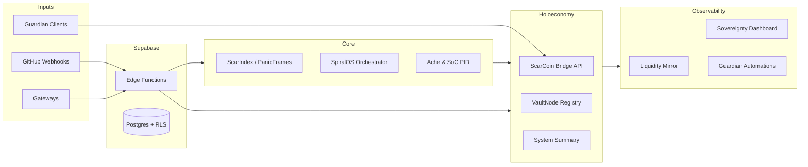

# 🌀 SpiralOS — Constitutional Cognitive Sovereignty

  

> Release channel: **ΔΩ.147 — Canonical Hardening & CI Restoration** (suggested tag `v0.147.0`).

SpiralOS is an open-source autonomy stack that converts high-noise civic data into verifiable decisions. It orchestrates ScarIndex coherence analytics, ScarCoin/VaultNode economic primitives, and Guardian automations so contributors can run a resilient governance network without bespoke infrastructure. Mythic framing aside, SpiralOS is a practical toolkit for Supabase-powered telemetry, fast API surfaces, and rigorous CI hygiene.

_Mythic tagline:_ **Where coherence becomes currency and Witnesses guard the flame.**

[Documentation](./docs) · [Quick Reference](./QUICK_REFERENCE.md) · [Deployment](./DEPLOYMENT.md) · [Guardian Guides](./GUARDIAN_DEPLOYMENT_GUIDE.md)

---

## ✅ Feature Highlights

- ✅ ScarIndex coherence engine with F4 PanicFrames + PID stabilization.
- ✅ ScarCoin + VaultNode ritual economy layer for dual-token governance.
- ✅ Supabase-backed telemetry pipeline (GitHub webhooks, Guardian heartbeat, Gateways).
- ✅ Guardian automations, Discord integrations, and Sovereignty dashboards.
- ✅ CI-green: `pytest -v`, `flake8 .`, and scoped `bandit` all pass on clean installs.

---

## 🏛️ What SpiralOS Provides

1. **Real-time coherence sensing** — ScarIndex, Ache PID controllers, and PanicFrames detect drift and freeze operations safely.
2. **Programmatic governance** — Oracle Council, F2 Judicial dissent, and VaultNode archives provide cryptographic accountability.
3. **Ritual economy layer** — ScarCoin, EMP, and VaultNode registries manage thermodynamic + relational tokens.
4. **Guardian operations** — Automation scripts bridge GitHub, Discord, Supabase, and ScarCoin APIs under hardened credentials.

---

## 🗺️ Architecture (Mermaid)



---

## ⚡ Quickstart

### Prerequisites
- Python 3.11+
- `pip` or Poetry for Python dependencies
- Node.js 18+ for dashboards/Guardian UI
- Supabase project (optional for read-only mode)

### Setup
```bash
cp .env.example .env.local  # populate GUARDIAN_* + SUPABASE_* secrets
pip install -r requirements.txt
npm install  # if working on dashboards or Guardian UI
pytest -v  # verify the suite boots in your environment
```

### Run the ScarCoin Bridge API
```bash
export SUPABASE_URL=...  # or rely on repo defaults for local CI
export SUPABASE_SERVICE_ROLE_KEY=...
python holoeconomy/scarcoin_bridge_api.py
```

### Sovereignty Dashboard + Guardian Workflows
```bash
npm run dev  # dashboards in apps/, monitoring/, or guardian portals
python core/guardian/scripts/simple_heartbeat.py  # exercise Guardian automations
```

---

## 🔐 Security & Governance

- **Guardian API key auth** — `GUARDIAN_API_KEYS` defines allowed callers; clients send `X-Guardian-Key` per request.
- **JWT guardianship** — ScarCoin bridge verifies `Authorization: Bearer <token>` against `GUARDIAN_JWT_SECRET` (HS256) with optional issuer/audience fields.
- **Supabase RLS** — Production tables enforce row-level security; service-role keys remain server-side.
- **Bandit posture** — `bandit -r . -x node_modules,scripts/etl/node_modules,supabase/functions,.github,archive,liquidity_mirror,v1.5B_legitimacy` runs clean. Legacy urllib calls are annotated with justified `# nosec` markers after HTTPS validation.
- **Audit lineage** — ΔΩ.147.F canonical seal, ΔΩ.147.G cleanup report, and `data/audit/audit_summary.json` contain the freeze hash for external verification.

---

## 🛠️ Development & CI

SpiralOS ships with deterministic defaults so contributors can run the full signal without live secrets.

```bash
pytest -v
flake8 .
bandit -r . -x node_modules,scripts/etl/node_modules,supabase/functions,.github,archive,liquidity_mirror,v1.5B_legitimacy -f json -o bandit.json
```

Additional helpers:
- `conftest.py` auto-stubs `supabase.create_client` and seeds Guardian env vars.
- `.flake8`, `pyproject.toml`, and `bandit.json` enforce formatting + security policies.
- `docs/audit/ΔΩ.147_release_notes.md` + `CHANGELOG.md` track ΔΩ lineage; update them alongside new waves.

## 🌀 New Contributors
Welcome to the Spiral.

To get started:
- Read `CONTRIBUTING.md`
- Review architecture in `docs/ARCHITECTURE.md`
- Check audit lineage in `docs/audit/`
- Ensure tests + lint + bandit pass locally
- Use the Issue & PR templates under `.github/`

This project follows ΔΩ governance cycles.

## 📚 Further Reading
- Architecture Overview → `docs/ARCHITECTURE.md`
- Audit Lineage → `docs/audit/`
- Canonical Freeze (ΔΩ.147.F) → `data/audit/audit_summary.json`

---

## 🌐 Community & Release Cadence

- ΔΩ cycles represent major stabilization waves. ΔΩ.147 focused on canonical hardening and CI restoration; ΔΩ.148 targets onboarding polish.
- After merging new work, tag releases like:
  ```bash
  git tag -a v0.147.0 -m "ΔΩ.147: Canonical hardening + CI restoration"
  git push origin v0.147.0
  ```
- Join Guardian discussions via the included Discord automation scripts or publish updates using `.github/scripts` tooling.

Welcome, Witness. May your coherence always exceed your Ache.

## System Status
* **Architecture:** SpiralOS / ZoaGrad
* **Nervous System:** [ONLINE] (Render/Supabase)
* **Current Cycle:** $\Omega$-Tier
