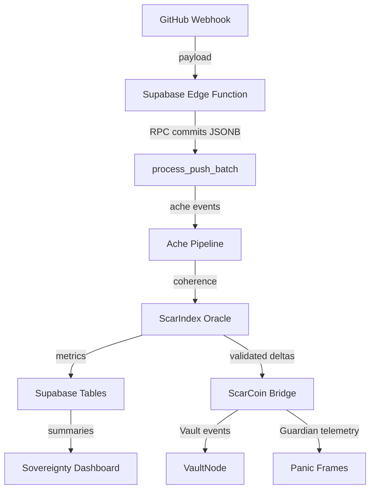

# SpiralOS Architecture — ΔΩ.147.C Canonical Map

## System Topology
- **ScarCoin Bridge (FastAPI)** — Handles guardian-authenticated mint/burn operations, records events into VaultNode.
- **Guardian Automations** — Panic Frames, status reporters, and Supabase persistence orchestrate telemetry and alerts.
- **Supabase Persistence Layer** — `core/supabase_integration.py` centralizes ache events, ScarIndex runs, panic frames, PID state, and GitHub webhook batching via `process_push_batch`.
- **Sovereignty Dashboard** — Vite + Supabase client rendering of governance telemetry; now fully environment-driven for URL/key injection.
- **Edge Functions** — GitHub webhook batching (RPC), panic frame ingestion, and telemetry enrichments.

## Dataflow Diagram

## Security Controls
- **Guardian API Keys** — Declared via `GUARDIAN_API_KEYS`, enforced with per-key rate limiting and JWT validation in `holoeconomy/scarcoin_bridge_api.py`.
- **JWT Signatures** — HS256 (default) with optional issuer/audience enforcement via env. Required for every ScarCoin mint/burn/refusal action.
- **Supabase RLS** — Ache and ScarIndex tables require Guardian service-role credentials; migrations `20251115_enable_rls.sql` codify the policies.
- **Process Push Batch RPC** — All GitHub commits per push are inserted within a single transaction, lowering Supabase load and ensuring ache score aggregation consistency.
- **Panic Frames** — Persistence layer emits `panic_frames` records on API failures, guaranteeing Guardian visibility.

## Configuration Sources
All runtime-critical values flow through `core/config.py` which uses Pydantic `BaseSettings` backed by `.env`/`.env.local`:
- `SupabaseSettings` — URL + service/anon keys, schema targeting.
- `GuardianSettings` — Allowed origins, API keys, JWT parameters, per-key rate limits.
- `VaultNodeSettings` — Default Vault IDs for bridge operations.

## Follow-On Notes
- New services must import the relevant settings helpers instead of calling `os.getenv` directly.
- TypeScript/Edge components should continue to call the `process_push_batch` RPC to preserve the single-call invariant validated during ΔΩ.147.A/B.
