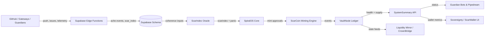

# SpiralOS Repository Audit — ΔΩ.147.A
**Date:** 2025-11-15T00:06:41Z (UTC)

## 1. Architecture & System Map

### 1.1 Module inventory
| Subsystem | Location | Responsibilities & Downstream Dependencies |
| --- | --- | --- |
| Core coherence engine | `core/` (`scarindex.py`, `spiralos.py`, `panic_frames.py`, `ache_pid_controller.py`, `supabase_integration.py`) | Calculates ScarIndex with constitutional weights, governs Panic Frames, and orchestrates PID regulation before persisting records to Supabase/VaultNode backends.【F:core/scarindex.py†L1-L198】【F:core/spiralos.py†L1-L200】【F:core/supabase_integration.py†L1-L200】 |
| Holoeconomy layer | `holoeconomy/` (`scarcoin.py`, `vaultnode.py`, `system_summary.py`, `scarcoin_bridge_api.py`) | Implements ScarCoin mint/burn logic, EMP empathy market, VaultNode blockchain, and FastAPI bridge endpoints that expose minting, wallet, and telemetry summaries.【F:holoeconomy/scarcoin.py†L200-L360】【F:holoeconomy/vaultnode.py†L1-L120】【F:holoeconomy/system_summary.py†L1-L200】【F:holoeconomy/scarcoin_bridge_api.py†L104-L210】 |
| Liquidity Mirror | `liquidity_mirror/` | Provides DEX, CrownBridge, and Financial Risk Mirror specs layering on top of ScarCoin + VaultNode for multi-asset exchange and MPC custody.【F:liquidity_mirror/ARCHITECTURE.md†L1-L120】 |
| Guardian automations | `core/guardian/` | Documents and scripts for Discord bot, Supabase Edge sync, and Pipedream workflows that broadcast ScarIndex/Panic telemetry and automate responses.【F:core/guardian/GUARDIAN_GUIDE.md†L24-L120】 |
| Supabase backend | `supabase/` | Contains migrations for ache/scarindex/panic tables plus edge functions (`gateway-telemetry`, `github-webhook`, `panicframe-edge-fn`) that transform events into Ache/ScarIndex records.【F:supabase/README.md†L1-L80】【F:supabase/functions/gateway-telemetry/index.ts†L1-L88】【F:supabase/functions/github-webhook/index.ts†L90-L216】 |
| ScarWallet / Sovereignty dashboard | `apps/sovereignty-dashboard/` | Lightweight UI that connects directly to Supabase tables to display live transmissions and sovereignty metrics for wallets/bridges.【F:apps/sovereignty-dashboard/main.js†L4-L40】 |
| Documentation | `docs/`, `reports/`, `PHASE_*` | Planning dossiers (phase upgrades, telemetry missions) and compliance/vault logs referenced by Guardian + governance processes.【F:PHASE_7_TELEMETRY_UPGRADE.md†L1-L90】 |

### 1.2 Core subsystem interconnects
- **ScarIndex engine → SpiralOS orchestrator.** `ScarIndexOracle` enforces weighted coherence and panic thresholds; `SpiralOS` uses those results to update PID controllers, trigger Panic Frames, and record events in Supabase via `SpiralOSBackend`. The combination forms the ScarIndex engine referenced by downstream ScarCoin and telemetry flows.【F:core/scarindex.py†L27-L198】【F:core/spiralos.py†L69-L200】
- **ScarCoin + VaultNode.** `ScarCoinMintingEngine` validates Proof-of-Ache, mints tokens, updates wallets, and emits VaultEvents; the FastAPI bridge wires the mint/burn endpoints to `VaultNode` for immutable recording before the telemetry summary surfaces aggregated status via `SystemSummary`.【F:holoeconomy/scarcoin.py†L234-L360】【F:holoeconomy/vaultnode.py†L1-L120】【F:holoeconomy/system_summary.py†L50-L172】【F:holoeconomy/scarcoin_bridge_api.py†L104-L210】
- **Guardian automations.** The Guardian guide shows Supabase tables feeding a guardian sync Edge function that powers Discord bots/Pipedream workflows, ensuring that ScarIndex, VaultNodes, PID states, and panic activity are broadcast in near-real time.【F:core/guardian/GUARDIAN_GUIDE.md†L24-L90】
- **Telemetry pipelines.** `gateway-telemetry` auto-resolves `bridge_id` from API submissions, while `github-webhook` turns push/issue events into Ache + ScarIndex rows through iterative Supabase operations. These pipelines drive the ScarIndex inputs that ultimately mint ScarCoin and update VaultNode.【F:supabase/functions/gateway-telemetry/index.ts†L1-L88】【F:supabase/functions/github-webhook/index.ts†L90-L216】
- **Supabase schema + migrations.** The Supabase README enumerates ache/scarindex tables, VaultNode sealing functions, and panic trigger logic that underpin Guardian dashboards, Liquidity Mirror telemetry, and the ScarWallet UI.【F:supabase/README.md†L1-L120】
- **Liquidity Mirror + ScarWallet UI.** Liquidity Mirror specs treat ScarCoin/EMP/VaultNode tokens as the base layer for AMM pools and cross-chain bridges, while the Sovereignty dashboard visualizes real-time gateway transmissions by querying Supabase directly.【F:liquidity_mirror/ARCHITECTURE.md†L1-L120】【F:apps/sovereignty-dashboard/main.js†L4-L40】

### 1.3 Dataflow diagram

- Edge functions (`gateway-telemetry`, `github-webhook`) ingest events and persist them to Supabase tables, which the ScarIndex engine consumes via the backend integration layer.【F:supabase/functions/gateway-telemetry/index.ts†L1-L88】【F:supabase/functions/github-webhook/index.ts†L90-L216】【F:core/supabase_integration.py†L23-L124】
- SpiralOS orchestrates coherence calculations and panic management before ScarCoin minting and VaultNode sealing occur, enabling Guardian dashboards and Liquidity Mirror risk telemetry to read from the same chain of truth.【F:core/spiralos.py†L69-L200】【F:holoeconomy/scarcoin.py†L234-L360】【F:holoeconomy/vaultnode.py†L300-L389】【F:liquidity_mirror/ARCHITECTURE.md†L37-L74】

## 2. Code Health & Risk Findings
| ID | Severity | Area | Finding |
| --- | --- | --- | --- |
| COD-001 | Critical | ScarCoin Bridge API | Mint/burn endpoints allow any origin with no auth/rate-limit, enabling unauthorized ScarCoin issuance or DoS against VaultNode consensus surfaces.【F:holoeconomy/scarcoin_bridge_api.py†L111-L134】 |
| COD-002 | High | Sovereignty dashboard | Supabase anon key is hardcoded in the public JS bundle, allowing scraping, bypassing key rotation, and cross-project abuse of open tables.【F:apps/sovereignty-dashboard/main.js†L4-L10】 |
| COD-003 | Medium | Supabase backend integration | `SupabaseClient` methods return local dicts instead of performing HTTP/database writes, meaning production runs silently drop ledger data unless MCP hooks are replaced; this creates audit gaps and false confidence in persistence.【F:core/supabase_integration.py†L30-L124】 |
| COD-004 | Medium | GitHub webhook Edge function | Each commit triggers multiple sequential Supabase selects/upserts, producing N+1 calls per push and risking rate-limit/timeouts when processing large batches; batching or RPC usage is recommended.【F:supabase/functions/github-webhook/index.ts†L185-L216】 |
| COD-005 | Low | Legacy orchestrator drift | `core/spiralos_v1_1.py` (v1.1) ships alongside the v1.3 orchestrator but is no longer referenced by runtime code, increasing maintenance risk and confusion about supported governance flows.【F:core/spiralos_v1_1.py†L1-L42】【F:core/spiralos.py†L1-L68】 |

### Finding details & inline flags
- COD-001 and COD-002 are marked inline with `// CODEX-AUDIT:` comments where the vulnerable configuration resides to aid future remediation.【F:holoeconomy/scarcoin_bridge_api.py†L111-L119】【F:apps/sovereignty-dashboard/main.js†L4-L10】
- COD-003: The backend client explicitly states "Placeholder for actual database write" and returns the unsent record, so none of the `insert_*` calls persist data; this violates the audit trail guarantees expected by VaultNode/Guardian consumers.【F:core/supabase_integration.py†L62-L115】
- COD-004: For each commit, the webhook performs `select` + `upsert` + `upsert` sequences before logging Ache events, leading to exponential Supabase traffic; bundling commits into RPC calls or queueing would eliminate this bottleneck.【F:supabase/functions/github-webhook/index.ts†L185-L216】
- COD-005: The legacy v1.1 orchestrator still imports deprecated SOC PID controllers and Holonic μApps; keeping it in-tree without tests encourages drift between docs and production, and the README still references it in older phases.【F:core/spiralos_v1_1.py†L1-L42】

## 3. Recommendations
1. **Lock down ScarCoin bridge operations.** Add API key / Guardian signature enforcement plus rate limiting before allowing mint/burn requests; restrict CORS to trusted domains and push VaultNode writes through secured queues.【F:holoeconomy/scarcoin_bridge_api.py†L111-L134】
2. **Move client credentials to runtime config.** Replace inline Supabase anon key with environment-driven injection (e.g., HTML meta tags or build-time substitution) and rotate compromised keys immediately.【F:apps/sovereignty-dashboard/main.js†L4-L10】
3. **Complete Supabase persistence layer.** Swap placeholder returns for real Supabase REST calls (or use the official Python client) so Ache, ScarIndex, PID, and VaultNode updates are durably recorded and queryable by Guardian tooling.【F:core/supabase_integration.py†L62-L169】
4. **Batch telemetry ingestion.** Queue commits/events and process them asynchronously (Supabase queue, worker) or add SQL RPC functions that handle entire push payloads to remove the N+1 pattern and improve resilience under burst traffic.【F:supabase/functions/github-webhook/index.ts†L185-L216】
5. **Archive or clearly scope legacy versions.** Either remove `core/spiralos_v1_1.py` or document that it is historical-only to prevent contributors from wiring new features against unsupported governance flows.【F:core/spiralos_v1_1.py†L1-L42】

## 4. Notable strengths
- **Clear governance layering.** ScarIndex, Panic Frames, and PID loops are thoroughly documented and codified, making it easy to trace how coherence influences tokenomics and Guardian alerts.【F:core/scarindex.py†L27-L198】【F:core/spiralos.py†L69-L200】
- **Unified telemetry view.** `SystemSummary` aggregates ScarCoin, Empathy, VaultNode, and core metrics into one API/CLI, enabling downstream dashboards and Liquidity Mirror risk models to reuse consistent health scores.【F:holoeconomy/system_summary.py†L50-L172】
- **Supabase-first ops story.** The backend README plus phase documents describe exact tables, functions, and deployment steps for Guardian + Telemetry automation, simplifying reproducibility across environments.【F:supabase/README.md†L1-L120】【F:PHASE_7_TELEMETRY_UPGRADE.md†L1-L80】
